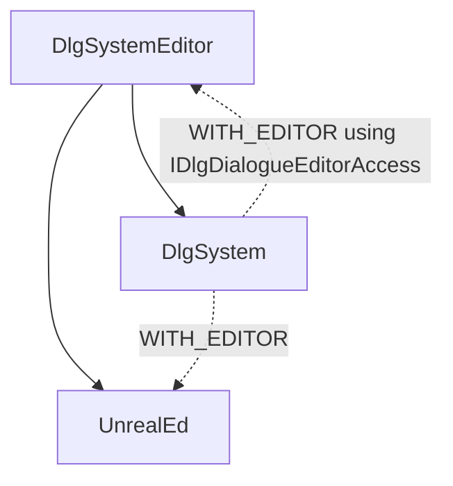

#  Dialogue System

**[🐛 CHANGELOG HERE](./CHANGELOG.md)**

Brought to you by Not Yet:
* [💬 Discord](https://bit.ly/NYDiscord)
* [🔢 Plugin Source Code](https://bit.ly/DlgSource)
* [🛒 Plugin Marketplace](https://bit.ly/DlgMarketplace)
* [📖 Wiki/Documentation](https://bit.ly/DlgWiki)
* [Plugin Forum post](https://bit.ly/DlgForum)
* Website: [warriorb.com](http://www.warriorb.com)
* [Twitter]( https://twitter.com/NotYetDevs)

## Modules dependency

