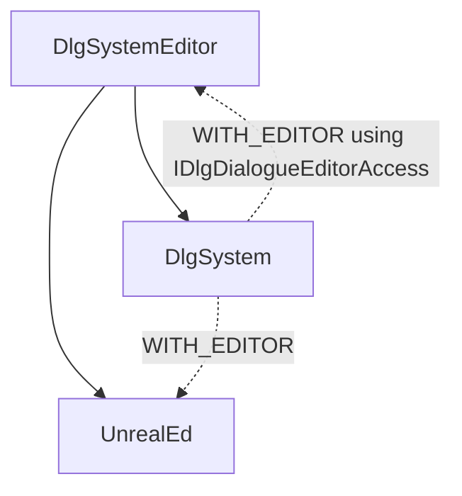

# DlgSystem (Dialogue System) Plugin

Branch Unreal version: `4.23`

## Features:

- 100% free, source code included
- Full Blueprint and C++ support
- Events and conditions
- Branching based on different node types and conditions
- Well structured runtime and editor modules
- Full editor support including:
    - Graph Editor
    - Search window
    - Dialogue Browser to get a good overview of all the dialogues
    - Customized blueprint nodes to handle certain events and conditions in Blueprint easily
    - Settings panel in Project Settings to modify the layout
    - Option to import from and export to plain text formats (e.g. json)
    - Real time display/edit functionality of the Dialogue runtime data.

Not yet convinced? Have you seen our [`showcase page`](https://gitlab.com/NotYetGames/DlgSystem/wikis/Feature-Showcase)?

## General Information

This plugin is primary developed and used for our own [game (WarriOrb)](http://www.warriorb.com).
We have put significant effort into it and decided to make it open source in order to help out other teams facing similar challenges.

Contribution, feedback and constructive criticism are appreciated and we would be really happy to hear about your game using our tool.

See [Support](#support) for how to support this project.

See the [Wiki](https://gitlab.com/NotYetGames/DlgSystem/wikis/home) for the manual and tutorials.

[DlgSystemExample project](https://gitlab.com/NotYetGames/DlgSystemExample/tree/4.24) is also provided.

Brought to you by Not Yet:
* Discord: https://discord.gg/NotYet
* Website: [warriorb.com](http://www.warriorb.com)
* Twitter: https://twitter.com/NotYetDevs
* [Plugin Forum post](https://forums.unrealengine.com/community/community-content-tools-and-tutorials/1424923-open-source-dialogue-system-plugin)
* [Plugin Marketplace](https://www.unrealengine.com/marketplace/not-yet-dialogue-system)

## Support

NOTE: that initially the plugin was free on the marketplace but later we switched to a small fee because maintaining all of the binary versions for different engine targets took a lot of time, consider buying the plugin on the marketplace as a donation :).

### Buy us some tea/coffee

You can buy [this plugin](https://www.unrealengine.com/marketplace/not-yet-dialogue-system) or our other plugins on the [unreal engine marketplace](https://www.unrealengine.com/marketplace/en-US/profile/Not+Yet) and always get binary support for the latest 3 engine versions.

Or you can just donate for that cup of tea/coffee :):

### Spread the word

Should it prove useful to you, the best way to say thanks is to mention us and our game to your own audience.

## Modules dependency

## Conventions

### Branches

The supported unreal versions have their own branches.
The outdated version branches are kept but not updated anymore.

### Code Style

The code style follows the one from the [UE Coding Standard](https://docs.unrealengine.com/latest/INT/Programming/Development/CodingStandard/)
with the additional changes located in the [`.editorconfig`](.editorconfig).

### Commit messages

Every commit message that has `[C]` means that after updating to that commit, a recompile is required.
Eg: `[C] Added awesome Dialogue feature`

Every commit message that has `[G]` means that after updating to that commit the solution files should be regenerated (and recompiled, *obvious*).
(`Right click on project file` -> `Generate Visual Studio project files`) (or from the command line regenerate the project).

Eg: `[G] New Dialogue Editor mode`
